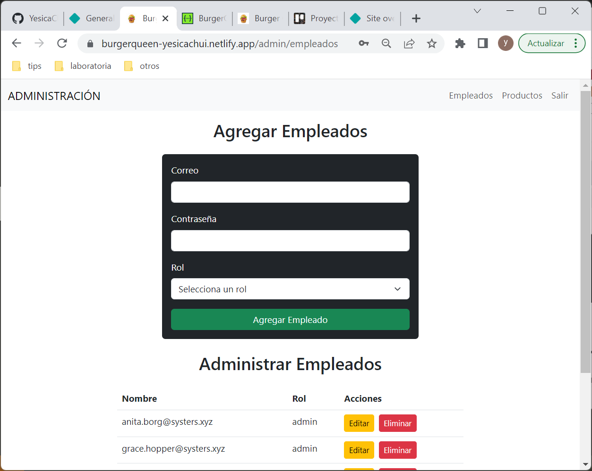
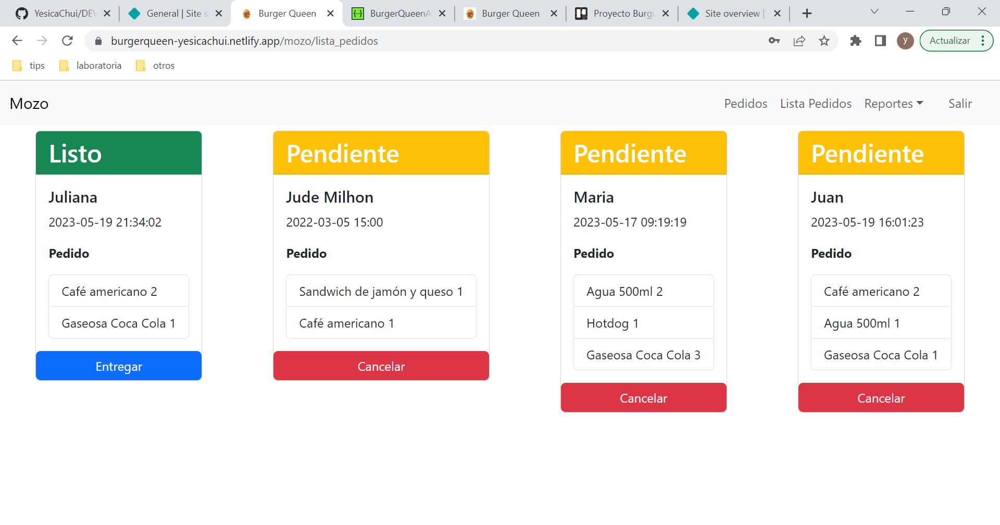

# Burger Queen (API Client)

## Índice

* [1. Introducción](#1-introducción)
* [2. Historias de Usuario](#2-historias-de-usuario)
* [3. Planificación](#3-planificación)
* [4. Consideraciones de la api](#4-consideraciones-de-la-api)
* [5. Prototipo de Interfaces](#5-prototipo-de-interfaces)
* [6. Implementación de Interfaces](#6-implementación-de-interfaces)
* [7. Test Unitarios y Asincronos](#7-test-unitarios-y-asincronos)
* [8. Despliegue](#8-despliegue)
* [9. Cómo usar](#9-cómo-usar)
* [10. Referencias](#10-referencias)

***

## 1. Introducción

En este proyecto se construyo una plataforma para un pequeño restaurante de hamburguesas, que está creciendo, necesita un sistema a través del cual puedan tomar pedidos usando una _tablet_, y enviarlos
a la cocina para que se preparen ordenada y eficientemente.

Este proyecto tiene dos áreas: interfaz (cliente) y API (servidor). Nuestra
clienta nos ha solicitado desarrollar la interfaz que se integre con una API.

Para lograr este objetivo se implemento la plataforma con el framework de React haciendo uso de peticiones http a la api, a su vez para los estilos se uso el framework de Bootstrap.

## 2. Historias de Usuario

El backlog del proyecto es el siguiente

#### [Historia de usuario 1] Mesero/a debe poder ingresar al sistema, si el admin ya le ha asignado credenciales

Yo como meserx quiero poder ingresar al sistema de pedidos.

##### Criterios de aceptación

* Acceder a una pantalla de login.
* Ingresar email y contraseña.
* Recibir mensajes de error comprensibles, dependiendo de cuál es el error
  con la información ingresada.
* Ingresar al sistema de pedidos si las crendenciales son correctas.

***

#### [Historia de usuario 2] Mesero/a debe poder tomar pedido de cliente/a

Yo como meserx quiero tomar el pedido de unx clientx para no depender de mi mala
memoria, para saber cuánto cobrar, y enviarlo a la cocina para evitar errores y
que se puedan ir preparando en orden.

##### Criterios de aceptación

* Anotar nombre de clientx.
* Agregar productos al pedido.
* Eliminar productos.
* Ver resumen y el total de la compra.
* Enviar pedido a cocina (guardar en alguna base de datos).
* Se ve y funciona bien en una _tablet_

***

#### [Historia de usuario 3] Jefe de cocina debe ver los pedidos

Yo como jefx de cocina quiero ver los pedidos de lxs clientxs en orden y
marcar cuáles están listos para saber qué se debe cocinar y avisar a lxs meserxs
que un pedido está listo para servirlo a un clientx.

##### Criterios de aceptación

* Ver los pedidos ordenados según se van haciendo.
* Marcar los pedidos que se han preparado y están listos para servirse.
* Ver el tiempo que tomó prepara el pedido desde que llegó hasta que se
  marcó como completado.

***

#### [Historia de usuario 4] Meserx debe ver pedidos listos para servir

Yo como meserx quiero ver los pedidos que están preparados para entregarlos
rápidamente a lxs clientxs que las hicieron.

##### Criterios de aceptación

* Ver listado de pedido listos para servir.
* Marcar pedidos que han sido entregados.

***

#### [Historia de usuario 5] Administrador(a) de tienda debe administrar a sus trabajadorxs

Yo como administrador(a) de tienda quiero gestionar a los usuarios de
la plataforma para mantener actualizado la informacion de mis trabajadorxs.

##### Criterios de aceptación

* Ver listado de trabajadorxs.
* Agregar trabajadorxs.
* Eliminar trabajadoxs.
* Actualizar datos de trabajadorxs.

***

#### [Historia de usuario 6] Administrador(a) de tienda debe administrar a sus productos

Yo como administrador(a) de tienda quiero gestionar los productos
para mantener actualizado el menú.

##### Criterios de aceptación

* Ver listado de productos.
* Agregar productos.
* Eliminar productos.
* Actualizar datos de productos.

## 3. Planificación

El desarrollo del proyecto fue realizado en 5 Sprints

* El primer Sprint fue para el analisis del problema y organización
* El segundo Sprint fue orientado al Login e ingreso con las credenciales correctas
* El Tercer Sprint se implemento las funcionalidades de las gestion de trabajadores y productos
* El  cuarto Sprint se implemento las funcionalidades paraq que el mesero puedo tomar pedidos del cliente y ver los pedidos listos y pendientes
* El quinto Sprint se realizo la funcionalidad del rol de jefe de cocina para que visualice los pedidos pendientes y completados

## 4. Consideraciones de la API

El proyecto usa una Mock Api que se desplego y esta disponible en https://burger-queen-api-mock-production-7906.up.railway.app

La aplicación construida consume las rutas según la documentación proporcionada [link a la documentación](https://app.swaggerhub.com/apis-docs/ssinuco/BurgerQueenAPI/2.0.0)

Para probar inicialmente las rutas se utilizo ThunderClient que es una extensión de Visual Studio Code que permite realizar y probar solicitudes HTTP

* Ejemplo de Petición Post para el login en ThunderClient

* Ejemplo de ingreso de Bearer en ThunderClient

* Ejemplo de ingreso del body en ThunderClient

## 5. Prototipo de Interfaces

* Prototipo del login y Administración

* Prototipo del mozo

* Prototipo de la interfaz de Cocina

## 6. Implementación de Interfaces

* Pantalla Login

***
### Administración

* Pantalla administración de empleados

* Pantalla de administración de productos

***
### Mozo
* Pantalla de Recepción de pedidos

* Pantalla de Lista de Pedidos

* Pantalla de Reporte de canceladas

* Pantalla de Reporte de entregadas

***
### Chef
* Pantalla de Pendientes

* Pantalla de Completadas

## 7. Test Unitarios y Asincronos

## 8. Despliegue

Para el despliegue de la aplicación del cliente se uso [Netlify](https://www.netlify.com/) , es una plataforma de _despliegue_ que nos permite desplegar nuestra aplicación web estática (HTML, CSS y JavaScript) y también nos permite desplegar aplicaciones web que se ejecutan en el servidor (Node.js).
* La aplicación se encuentra disponible en https://burgerqueen-yesicachui.netlify.app/

* Plataforma de Netlify

## 9. Cómo usar

Es necesario usar Node.js

Clonar el proyecto

` $ git clone https://github.com/YesicaChui/DEV004-burger-queen-api-client`

Instalar dependencias del proyecto

` $ yarn install`

Iniciar la aplicación

` $ yarn dev`

Realizar los test

` $ yarn test`

Para probar la aplicación
* Para el mozo
luisito@gmail.com clave 123456
* Para la cocina
franco@gmail.com clave 123456

## 10. Referencias

* [React](https://react.dev/)

* [Cómo usar async function con useEffect](https://dev.to/jasmin/how-to-use-async-function-in-useeffect-5efc)
* [Navega programáticamente con React Router](https://ultimatecourses.com/blog/programmatically-navigate-react-router)
* [Testing Components en React con Jest paso a paso](https://www.youtube.com/watch?v=FjJu3hcPSCY&ab_channel=Garajedeideas)